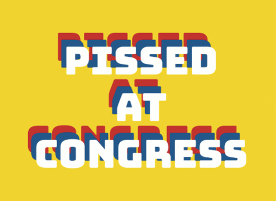
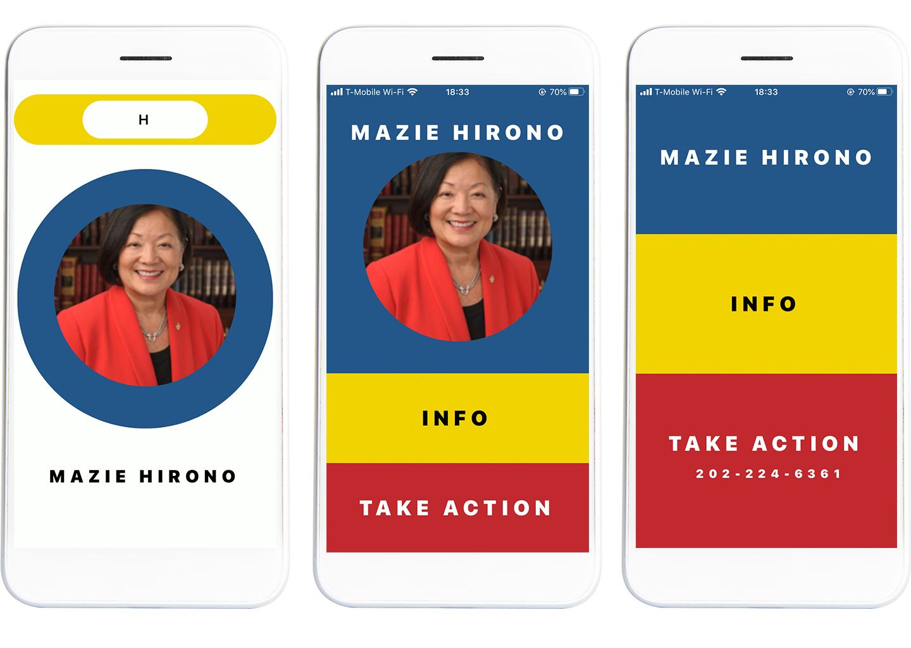
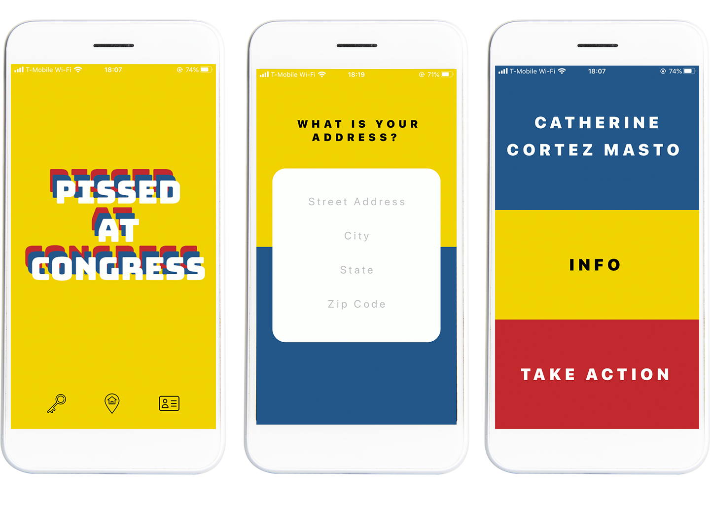

  

[SOURCE CODE](https://github.com/ommwong/pissed-at-congress)

Pissed At Congress is a React Native application to help people find and contact members of the United States Congress. I built this project from the ground up in one week.

  

 

# Project Purpose

I wanted to build Pissed At Congress because I know that many Americans are frustrated with the current state of politics and their elected leaders. But Americans can directly contact Congress to voice their complaints and advocate for issues they care about.

I wanted three core features as part of the MVP:

  1. Users can find their Congressmembers by entering their home address

  2. Users can search for a Congressmember by name

  3. Users can directly call a Congressmember directly with the app

  

 

# Tech Stack

Creating this project as a mobile app was a no-brainer because the core feature was to allow users to call Congressmembers directly on their phones. I chose React Native as the mobile UI library. Using Expo made sense for me because it was the quickest framework to get off the ground. For a one week project, development speed was crucial. ⏰

I used RESTful API to access congressional data from the [Google Civic Information](https://developers.google.com/civic-information) and the [ProPublica Congress](https://projects.propublica.org/api-docs/congress-api) APIs. In hindsight, GraphQL would have been a better choice for state and cache management and easier data retrieval.

 

# Workflow

The first day of development went primarily to setting up React Native and Expo as this was the first time I used these development dependencies. A learning curve is to be expected with any new tech stack. 🎢 🙃

Days 2-4 were the core development days, with the main features built within this timeframe. Even though this was a solo project, I tried to maintain as agile a workflow as possible. Each day was focused on building a single feature as quickly as possible.

Days 5-6 were all about UI design and experience. ✨

On day 6, my MVP was 'completed,' just short of my one-week deadline. With the core features and design finished, I moved on to the next 'sprint' of the project: building a server for user authentication.

  

 

# Challenges

As I mentioned, React Native and Expo were new tech stacks for me. There was a bit of a learning curve at the beginning, which ate into my development time. If I had more time with this project, this learning curve wouldn't have been an issue. But since this was just a one week project, taking a full day to get acquainted with a new tech stack was definitely challenging.

I also had some issues accessing and managing data using RESTful. Every API call contained a lot of unnecessary data, and the data I needed was deeply nested. Also, a new API call was made every time the component was updated. Caching the API calls with GraphQL might have been a more elegant approach.

 

# Room for Improvement

The project wasn't large enough for state management tools like Redux or Apollo Client, but I still came across instances where a stored state would have come in handy.

I would also completely scrape React Native, and redo this whole project using React and turn it into a Progressive Web App. 🖥  -> 📱

There's also a lot of room for more features! User auth and protected paths, responsiveness, allowing users to save and share information, refactoring to Typescript, and testing with Jest are just some ideas for growth.

 

# Lessons

Thanks to Pissed At Congress, I made a lot of progress in my continuing education with React. The React ecosystem is large and complex, but with huge potential, and I feel like I've only just scratched the surface. The learning curve is both daunting but exciting. 💃🏻

I also learned that having an 'MVP' mindset in development is crucial. Start very small and work fast.