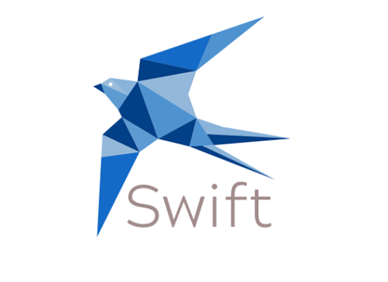

[SOURCE CODE](https://github.com/ajustinpatterson/Swift-Video-Meetings)

  

Swift Video Meetings is a video conferencing application I built alongside [Andrea Disperati](https://github.com/Andrea-Dispe) and [Justin Patterson](https://github.com/ajustinpatterson).

We built Swift from the ground up in two weeks. I was the back-end lead, responsible for building out the server and database. Our team extensively collaborated on all aspects of the application.

 

# Project Purpose

Our team wanted to build Swift Video Meetings because we wanted to work on a relevant and useful application. What is more relevant and useful than a video chat app as millions are working and schooling online thanks to COVID-19? 😷

Our MVP was simple:

<strong>Users can use Swift and communicate via video.</strong>

As part of our MVP, we wanted 3 additional features:

  1. Users can share their screens 💻

  2. Users can mute 🤐

  3. Users can start and stop their videos during a call 🛑

  4. Users can log in with Google

 

# Tech Stack

Our tech stack for Swift was large and complex. At the core, we used React for the front-end as it was a library that we all wanted to excel in. React was also the front-end library we were most comfortable with - for a complex 2-week project, development speed was important. Our back-end was an Express server with an Apollo Server as a middleware.

The video communication functionality required a few dependencies that were new to our team: [socket.io](https://socket.io/), [peer.js](https://peerjs.com/), and [MediaDevices API](https://developer.mozilla.org/en-US/docs/Web/API/MediaDevices).

We decided to write our front and back end with Typescript. Although Typescript added a layer of complexity to our project, it would quickly help us catch errors in a quick development environment. This was important - we wouldn't have time to implement unit testing before deploying our first iteration of the MVP.

Our database was postgreSQL with Sequelize ORM.

 

# Workflow

On our first day, we quickly worked on the wireframes and divided up responsibilities. We set up a schedule for twice-daily standup meetings and daily deliverables for each member of our team. It was important to us that we communicate often and knew what we were all working on. We wanted to maintain as agile of a team as possible with quick development speed in mind. 🏃🏻‍♀️ 🏃🏻‍♂️

The bulk of the development days were spent building the server and front-end for the video communication functionalities.

The last few days were spent on deploying the front and back end. Deployment was crucial because we couldn't properly test the video functionality with multiple peers on a local development server.

 

# Challenges

Connecting users via video was the most complex part of this project. We had significant issues connecting with other streams using the peer.js library. Fixing this issue required complex restructuring of the component, as we realized that the useEffect function did not rerender the component after a new peer entered a chat.

 

# Room for Improvement

After our first iteration, the project still requires significant work. The mute functionality is still buggy and a work in progress. There is also a lot of room for more features! We are currently working on adding custom rooms, as our MVP included only one static room.

 

# Lessons

Building Swift was extremely complex for a two-week sprint. We only made it more challenging with the large tech stack. In hindsight, we should have tampered down our ambitions a notch and chosen a leaner tech stack. 🙃

This project was a large and complicated code base to manage with a team of 3 developers. We all got some good experience with reviewing each other's code and with version control. We avoided 'merge hell' by communicating and merging often.

